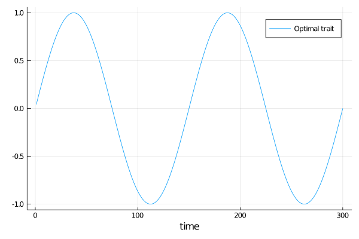
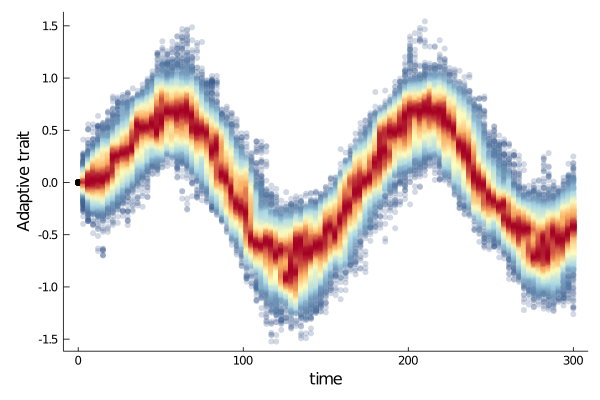

# Changing environments

In this tutorial, we define a birth function that is time dependent.  This can be related to changing environment, where the optimal adaptive trait changes because of underlying resource variability, e.g. related to climate.

## Defining the variation
```julia
  ω = 2* π / 150 # angular frequency
  optimal_trait(t) = sin(ω * t)
  tend = 300
  Plots.plot(1:tend,optimal_trait,label = "Optimal trait",xlabel = "time")
```


## Running
`optimal_trait` function is fed into the birth function, that we define as gaussian.

```julia
  myspace = (RealSpace{1,Float64}(),)
  K0 = 1000 # We will have in total 1000 individuals
  b(X,t) = gaussian(X[1],optimal_trait(t),1)
  d(X,Y,t) = 1/K0
  D = (5e-2,)
  mu = [1.]
  NMax = 2000
  p = Dict{String,Any}();@pack! p = d,b,D,mu,NMax
  myagents = [Agent(myspace,(0,),ancestors=true,rates=true) for i in 1:K0]
  w0 = World(myagents,myspace,p,0.)
  @time sim = run!(w0,Gillepsie(),tend,dt_saving=3.)
```

## Plotting

```julia
Plots.plot(sim)
```

