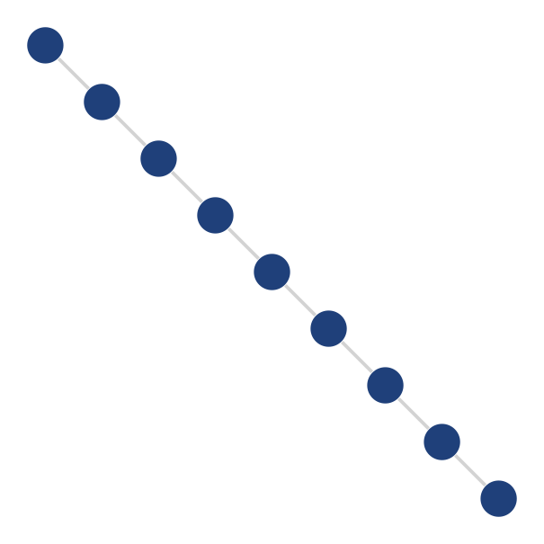
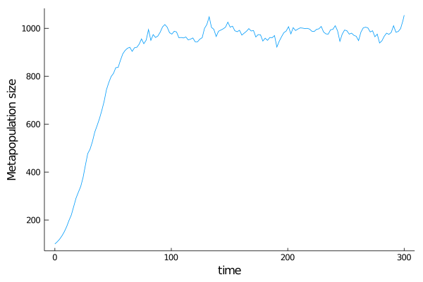
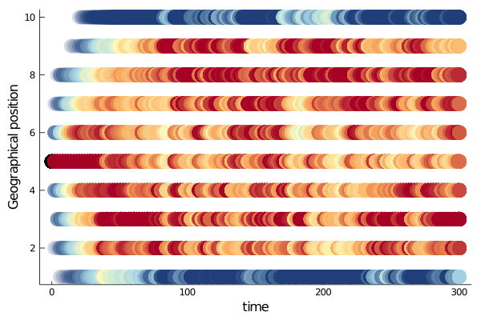

# A first model of meta population

In this script, we model the evolution of a population where agents are simply defined by their position on some landscape. We implement the simplest possible birth and death function.

## The landscape
Let's start by a linear landscape. We define a discrete segment of length `9`, with reflecting boundary conditions. In fact, reflecting boundary conditions are implemented for any finite space.

!!! warning "1D Reflections"
    As of v1, only reflections on one dimensional space are implemented. We have a two dimensional reflection method that will be released in the future.

There are two ways of implementing a linear landscape. The first one uses a `DiscreteSegment` while the second relies on LightGraphs.jl library. Both are *almost* equivalent.

### DiscreteSegment
```julia
using ABMEv
nodes = 10
mysegment = DiscreteSegment(1,nodes)
wholespace = (mysegment,)
```

### grid
```julia
using ABMEv, LightGraphs
nodes = 10
g = grid([nodes,1])
mysegmentgraph = GraphSpace(g)
wholespace = (mysegmentgraph,)
```
!!! warning "Space tuple"
    Notice that the whole space should be a *tuple of spaces*. Even where there is only one sub vector space as here, you need to have brackets and comma around the unit vector space.
Here is how you can visualise the landscape.

```julia
using GraphPlot
gplot(g, collect(1:nodes), collect(1:nodes))
```


## Defining competition processes
We propose that any individual have a constant birth rate, and competes with all the individuals present in the same patch. Assume there are ``N_t`` individuals at time ``t``.
Let ``i \in \{ 1,2,\dots,N_t\}``. ``x_{i,t} \in \{1,2,\dots,9\}`` denotes the position of the ``i``-th individual at time ``t``.
The competition pressure experienced by individual ``i`` is such that

```math
d(x_{i,t}) = \sum_j^{N(t)} \delta(x_{i,t}-x_{j,t})
```
where ``\delta`` is the dirac function.

In this way, we recover a logistic growth function for subpopulation within a patch.

```julia
K0 = 1000 # We will have in total 1000 individuals
b(X,t) = 1 / nodes
d(X,Y,t) = (X[1] ≈ Y[1]) / K0
```
At equilibrium, population size in each deme will reach `K0 / nodes`.

!!! warning "Time dependency"
    Even though time is not used, you have to write birth and death functions with time dependency.

## Dispersal
We assume that anytime an offspring is born, it is given a chance to move (`\mu = 1`).
```julia
mu = [1.]
D = (1.5,)
```
## Running the world
We initialise the world with initial population of size ``K_0 / 9`` located on patch `5`. `NMax` corresponds to the maximum number of individuals that can be attained. If attained, then the programm stops.
We keep track of individuals' ancestors by setting `ancestors=true`. Because we wish to use `Gillepsie` algorithm, we need `rates=true` as agents' internal birth and death rates are updated at every time step.
!!! note "Warning"
    `rates` treatment is something we might implement in the library internals.

```julia
using UnPack# useful macro @pack!
NMax = 2000
tend = 300.
p = Dict{String,Any}();@pack! p = d,b,D,mu,NMax
myagents = [Agent(myspace,(5,),ancestors=true,rates=true) for i in 1:K0/nodes]
w0 = World(myagents,myspace,p,0.)
@time sim = run!(w0,Gillepsie(),tend)
```
This is the simplest run you can do. Now time to more interesting things

## Analysis

### Size of the world
Let's verify that the population's growth is logistic. We will plot the population size over time.
To do so, one need to define `dt_saving` < `tend` to save every `dt_saving` time steps of the world.

```julia
wsize = [length(w) for w in sim[:]]
using Plots
Plots.plot(get_tspan(sim),wsize,
                label = "",
                ylabel = "Metapopulation size",
                xlabel ="time",
                grid = false)
```



!!! notes "Callbacks"
    Note that one could also use a callback function to obtain time series of size of the world computed at simulation time. See [Callbacks page](../manual/callbacks.md).

### Position through time

One might be tempted to plot the agents position for some time steps.

```julia
Plots.plot(sim,
        label = "",
        ylabel = "Geographical position",
        grid = false,
        markersize = 10)
```

