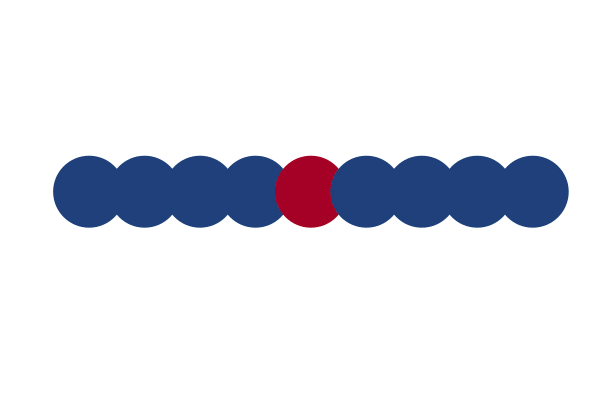
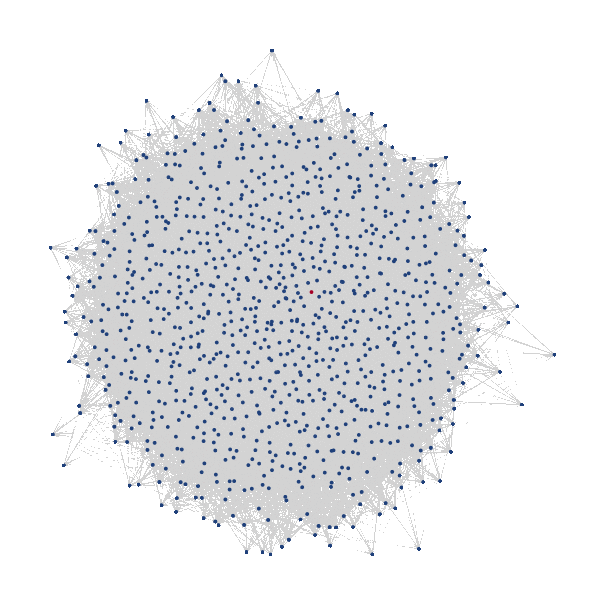

# [Modelling agents with a genetic structure](@id genetic_structure)

In this example, we show how to model a population evolving over a linear geographic space. The population is also defined by a genotype, which corresponds to the node of a **genotype graph**. The concept of genotype graph is better explained in [The architecture of an empirical genotype-phenotype map](http://doi.wiley.com/10.1111/evo.13487). Any two connected nodes in the genotype graph should be thought of as two related genomes, i.e that are very similar in their alleles / nucleotide. As such, if the genotype of an offspring differs from its parent, it will be located in the neighbourhood of it parent's genotype node.

## Defining the space
```julia
    ##### Genotype space#####
    dim_neutr = 1000
    magicprop = 523728 / 32896
    g = SimpleGraph{Int16}(dim_neutr,round(Int16,dim_neutr * magicprop))
    initnode = argmax(eigenvector_centrality(g)) # This is the central node the we will use to instantiate the populations
    myspace = (DiscreteSegment(Int8(1),Int8(nodes)),GraphSpace(g)) # union of vector spaces
```
## Defining birth, death processes and mutation

```julia
    K0 = 1000
    mu = [1.,1.]
    b(X,t) = 1 / nodes
    d(X,Y,t) = (X[1] ≈ Y[1]) / K0
    D = (5e-1,1.4825)
```

## Final set up

```julia
    NMax = 2000
    # tend = 1.5
    tend = 3000
    p_default = Dict{String,Any}();@pack! p_default = NMax,mu
    myagents = [Agent(myspace,(rand(Int8(1):Int8(nodes)),initnode),ancestors=true,rates=true) for i in 1:round(K0/nodes)]
    w0 = World(myagents,myspace,p_default,0.)
```

## Plotting
Plotting animations of graphs is a bit involved. If you want to learn about that, consult  `src/examples/genetic_structure.jl`.
### Geographical space


### Genetic space

