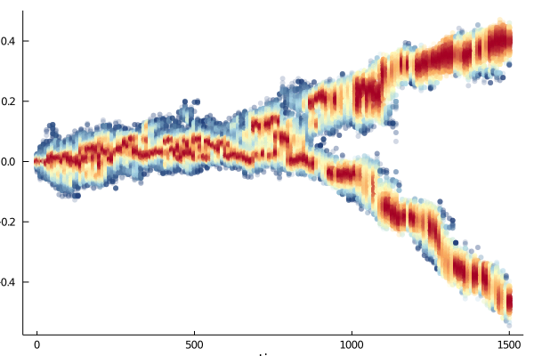

# Modelling Sympatric speciation

This script aims at reproducing the 1999 article of Doebeli [On The Origin of Species By Sympatric Speciation](http://www.nature.com/articles/22521).

In this article, birth and death functions are defined as gaussian, with respective variance ``\sigma_b`` and ``\sigma_d``. It is shown that when ``\sigma_d < \sigma_b``, speciation in the trait space occurs. This is what we reproduce here.

## Running the world
We need to run the simulation for a significant amount of time to observe sympatric speciation. As such, we set `ancestors=false`. The rest is pretty standard
```julia
myspace = (RealSpace{1,Float64}(),)
σ_b = .9;
σ_d = .7;
K0 = 1000
b(X,t) = 1.
d(X,Y,t) = gaussian(X[1],Y[1],σ_d)/K0 / gaussian(X[1],0.,σ_b)
D = (1e-2,)
mu = [.1]
NMax = 2000
tend = 1500
p = Dict{String,Any}();@pack! p = d,b,D,mu,NMax
myagents = [Agent(myspace,(1e-2 * randn(),),rates=true) for i in 1:K0]
w0 = World(myagents,myspace,p,0.)
@time sim = run!(w0,Gillepsie(),tend,dt_saving = 10)
Plots.plot(sim, ylabel = "Adaptive trait")
```

